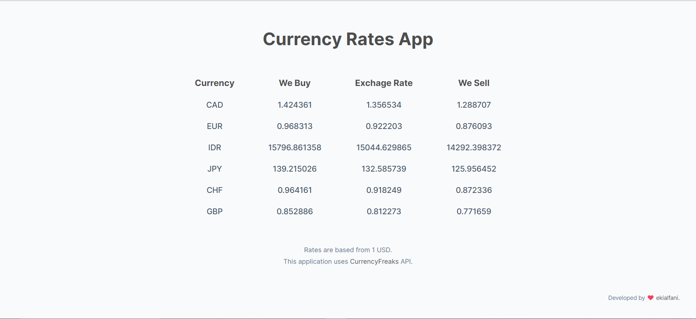

<h1 align="center">Currency Rates App</h1>
<div>
  
</div>

<br />

<div align="center">
  <p>The Currency Rates App is a simple application that allows users to view and compare current currency exchange rates. This application was built using the <a href="https://currencyfreaks.com/" target="_blank">CurrencyFreaks</a>  API.</p>

  <br />

  <a href="https://reliable-lokum-cdc945.netlify.app/">View Demo</a>
    &nbsp;·&nbsp;
    <a href="https://github.com/ekialfani/currency-rates-app/issues">Report Bug</a>
</div>

<br />
<br />

## Built With
- ReactJS
- CurrencyFreaks API

## Installation
* Clone the repo
  ```sh
  git clone https://github.com/ekialfani/currency-rates-app.git
  ```
* Install dependencies
  ```sh
  npm install
  #or
  yarn install
  ```
* Run the project
  ```sh
  npm start
  #or
  yarn start
  ```

##  Contributing
1. Fork the project
2. Create your feature branch (`git checkout -b my-new-feature`)
3. Commit to the branch (`git commit -am 'Add some feature'`)
4. Push to the branch (`git push origin my-new-feature`)
5. Create a new pull request

## Credits
This application was created by <a href="https://www.instagram.com/ekialfni/" target="_blank" rel="noreferrer">Eki Alfani</a>.